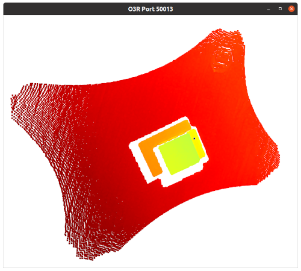
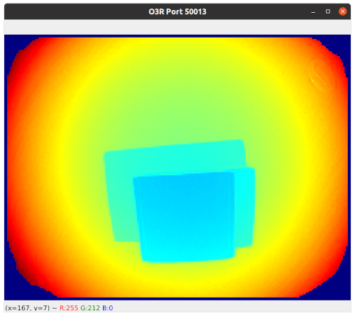
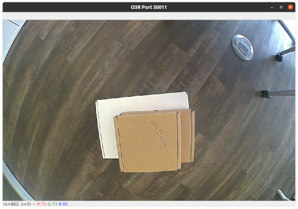

# ifm3d Overview

Library and utilities for working with ifm pmd-based 3D ToF Perception devices. Compatible with the O3R, O3D and O3X platforms. 
This library is available in python, c++, and has wrappers for ROS and ROS2.
Comprehensive documentation is available on [ifm3d.com](https://ifm3d.com/).

/badge.svg?branch=master)
/badge.svg?branch=master)

| 3D cloud | Distance | RGB |
| -- | -- | -- |
|  |  |  |
## Released Versions

⚠️ Note that the `master` branch is generally in a work in progress state and you probably want to use a
tagged [release version](https://github.com/ifm/ifm3d/releases) for production.

⚠️ Branch `o3r/main-next` is an O3R early adopters version which contains the latest changes to the interface. It may contain braking changes.

### Current Revision

The table below show the compatibility between the current ifm3d version and the firmware versions for the O3X, O3D and O3R devices. Other combinations than the ones listed below might work but have not been thoroughly tested.

| ifm3d version | Supported O3D Firmware Version | Supported O3X Firmware Version | Supported O3R Firmware Version | Supported Ubuntu Linux Version | Notes| 
| 1.0.x | Not supported, please use ifm3d 0.20.x | Not tested, please use ifm3d 0.20.x | 0.13.11, 0.14.23 | 20.04 | Major re-architecture of the library, please see the changelog and the migrating guide. |

> Note that a full compatibility matrix is available [here](ifm3d/doc/sphinx/content/swcompat:ifm3d%20Software%20Compatibility%20Matrix) for older versions.
## Organization of the Software

The ifm3d software is organized into modules, they are:

| Module name | Description |
| ----------- | ----------- |
| `device`      | Provides an implementation of the XMLRPC protocol for configuring the camera and pmd imager settings. |
| `framegrabber` | Provides an implementation of the PCIC protocol for streaming pixel data and triggered image acquisition.|
| `swupdater`  | Provides utilities for managing the SWUpdate subsystem of the camera. |
| `pcicclient` | Direct access to PCIC to, for example, actuate digital IO.|
| `tools` | Provides the ifm3d command line tool for manipulating and introspecting the hardware interactively. It is also suitable for usage within shell scripts to, for example, manage fleets of cameras.|
| `pybind11` | Provides python bindings through <a href="https://github.com/pybind/pybind11">pybind11</a> to the native C++ API. Supports all general camera functionality as well as a zero-copy interface to image data, exposed as NumPy arrays. |

## Installation instructions
Please refer to the corresponding section on [ifm3d.com](https://ifm3d.com/).

## Supported docker containers
Docker containers are available for the ifm3d library, both on [ghcr](https://github.com/orgs/ifm/packages?repo_name=ifm3d) and on the [dockerhub](https://hub.docker.com/r/ifmrobotics/ifm3d). 
You can pull them with:
```bash
docker pull ghcr.io/ifm/ifm3d:stable
```
OR
```bash
docker pull ifmrobotics/ifm3d:stable
```
Note that we provide 2 tags, *stable* always points to the latest tagged version, and *latest* is built nightly with the latest changes on the o3r/main-next branch. The *latest* tag is typically a work in progress.  
For more details on the available containers, see [here](ifm3d/doc/sphinx/content/installation_instructions/install_docker:Docker%20dev%20container).  
For more details on docker and the O3R platform see [here](documentation/O3R/Docker/README:Docker%20on%20O3R).

## Report a bug and check the known issues

Please see the [Github Issue Tracker](https://github.com/ifm/ifm3d/issues), or contact `support.robotics@ifm.com`.

## LICENSE

Please see the [LICENSE](LICENSE) file.
